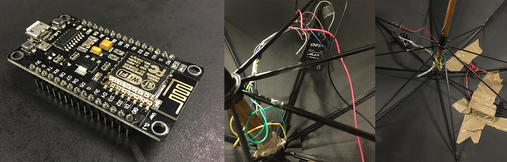

# Setup



## Board
- **Name:** ESP8266 NodeMCU
- **Producer:** LoLin/WeMos
- **Generation:** 2nd
- **Version:** 1.0
- **“Common” name**: v3

*More about the different NodeMCU boards [here](http://frightanic.com/iot/comparison-of-esp8266-nodemcu-development-boards/)*

## Getting started

### Install driver
Install WeMos driver and restart.
Download driver here: https://www.wemos.cc/downloads

**This driver doesn’t work with macOS Sierra, and it will crash your Mac when you plug in the NodeMCU.
Download the driver below to get it working on Sierra:**

https://github.com/adrianmihalko/ch340g-ch34g-ch34x-mac-os-x-driver

### Flash NodeMCU
1. Download [esptool](https://github.com/themadinventor/esptool) and follow the instructions.

2. To find the port of the NodeMCU use the following command: ```ls /dev/{tty,cu}.*```. It should be something similar to this ```/dev/cu.wchusbserial1410```

### Connect - CLI
Use [nodemcu-uploader](https://github.com/kmpm/nodemcu-uploader)

### Connect - GUI
Use [ESPlorer](http://esp8266.ru/esplorer/)

#### Setup of ESPlorer
1. Select the port from above.
2. Set baud rate to 115200.
3. Enable DTR and RTS.
4. Open port and press reset button on the NodeMCU.
5. When succesfull you should get a Lua REPL.


## Setup WiFi
There are two modes: ```wifi.STATION``` and ```wifi.SOFTAP``` - one is access point and the other is normal connection to WiFi.

To setup the wifi, use the lua ```credentials.lua``` setup-files I provided.
You should only need to make changes in that file. Avoid doing application logic outside ```application.lua```.

I recommend you give the machine running your server a static IP, and make the ESP8266 create a WiFI access point and connect to that IP. The chip should connect on port 8080.


## MQTT
The connection between the ESP8266 NodeMCU and the game uses the MQTT protocol.The ESP8266 runs as a client, so does the game/front-end.

## Connect to server
Restart the NodeMCU and let it connect.
Remember to start the server/broker **before** restarting the NodeMCU, otherwise it won't connect. When the first connection is made, it'll reconenct by itself.
